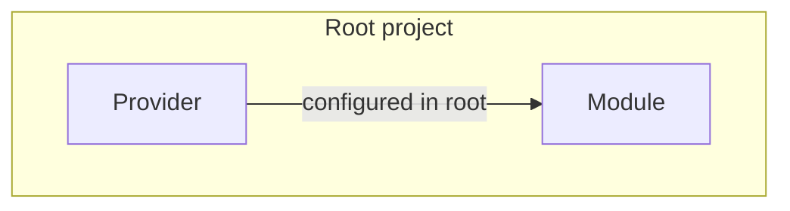
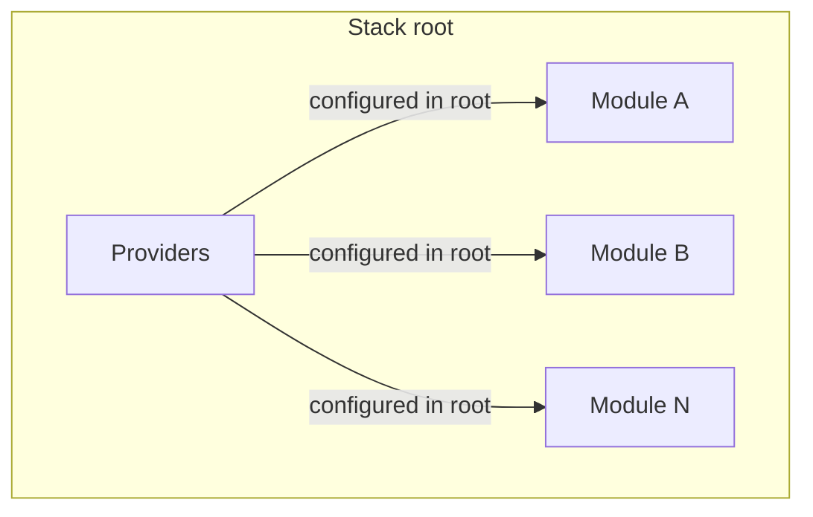

# Env Common

This package implements the cloud agnostic business logic and is one of the core modules.

## Provider

A **provider** is a Terraform provider package that can be published and versioned in the catalog. It is defined by a `provider.yaml` manifest and published with `publish_provider`. Providers are stored with composite keys (e.g. `PROVIDER#<name>`, `LATEST_PROVIDER`) and include metadata, Terraform variables, and a zip artifact. The catalog supports multiple provider versions; deployments resolve to the latest (or a chosen) version per provider.

## Module

A **module** is a reusable Terraform module published to the catalog. It is defined by a `module.yaml` manifest and published with `publish_module`. Modules are stored as `MODULE#<identifier>` and `LATEST_MODULE`, and carry version, track, Terraform variables/outputs, required providers, and an optional OCI artifact set. A module is built and run with its own root project that configures the provider and invokes the module. Modules can be downloaded by version and used as the building block for deployments or composed into stacks.

## Stack

A **stack** is a composition of one or more modules, defined by a `stack.yaml` manifest and claim manifests in the same directory. It is published with `publish_stack`. Stacks are stored like modules but use `LATEST_STACK` and `module_type: "stack"`. Publishing a stack merges providers from the claimed modules, generates a single Terraform root module from the claims, and publishes the result as a versioned catalog entry that can be deployed like a module. The stack root is created with the providers configured in the root and each claimed module invoked from that root.

