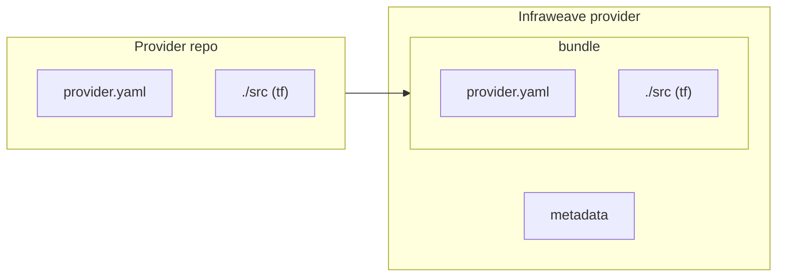
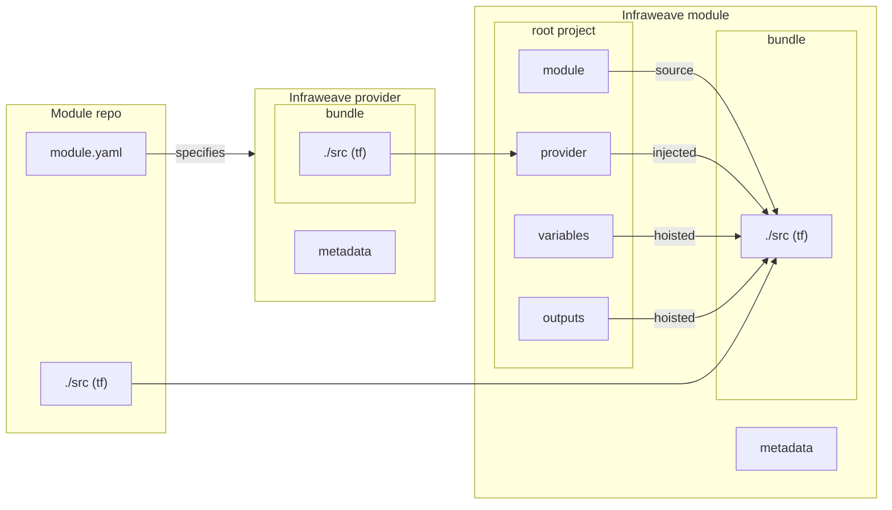
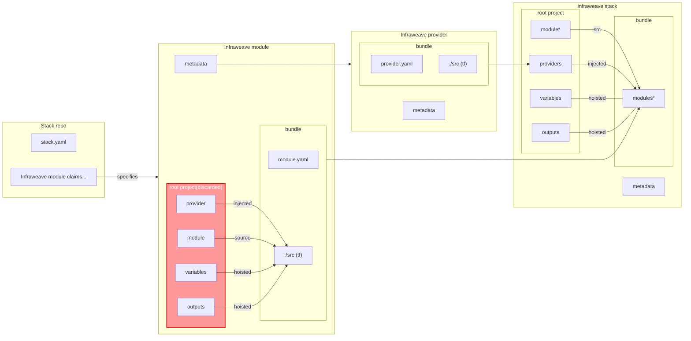

# Env Common

This package implements the cloud agnostic business logic and is one of the core modules.

## Provider

A **provider** is a Terraform provider package that can be published and versioned in the catalog. It is defined by a `provider.yaml` manifest. Providers are stored with metadata and a zip artifact.

## Module

A **module** is a reusable Terraform module published to the catalog. It is defined by a `module.yaml` manifest. Modules are stored with metadata and a zip. A module is built and run with its own root project that configures the provider and invokes the module. Modules can be downloaded by version and used as the building block in stacks.

## Stack

A **stack** is a composition of one or more modules, defined by a `stack.yaml` manifest and claim manifests. Stacks are stored like modules with metadata and a zip. Publishing a stack merges providers from the claimed modules, generates a single Terraform root module from the claims, and publishes the result as a versioned catalog entry that can be deployed like a module. The stack root is created with the providers configured in the root and each claimed module invoked from that root.

